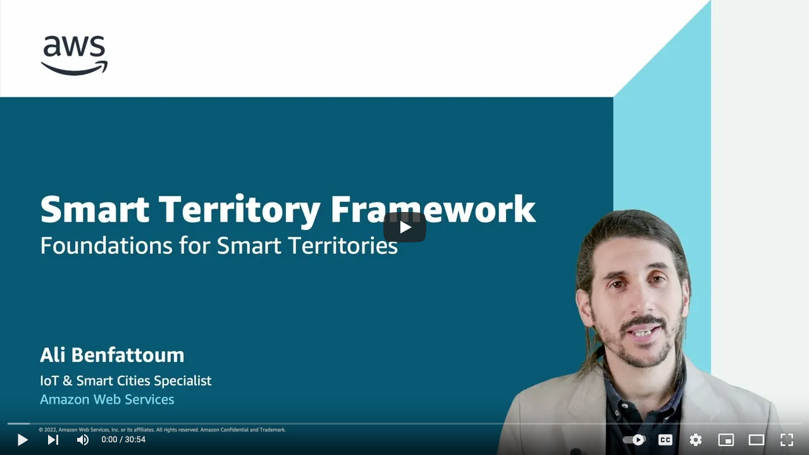
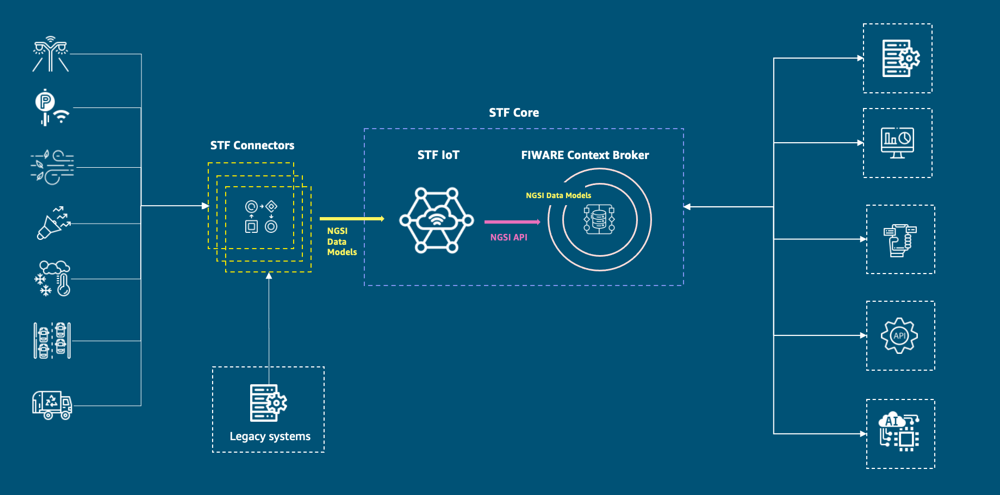
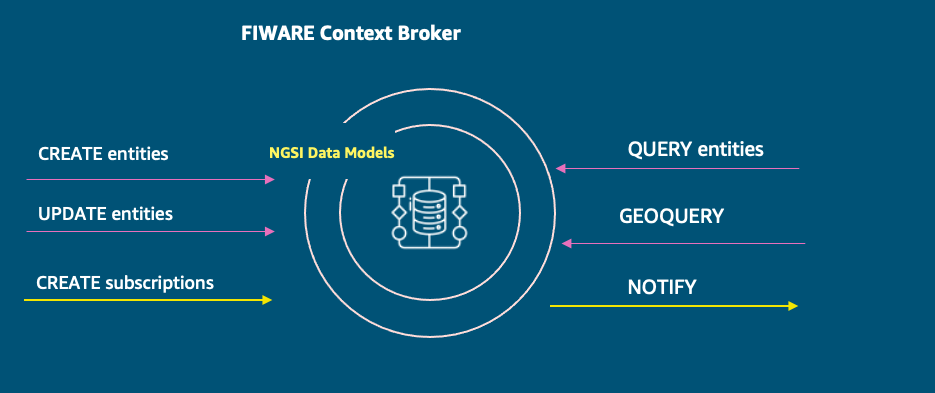
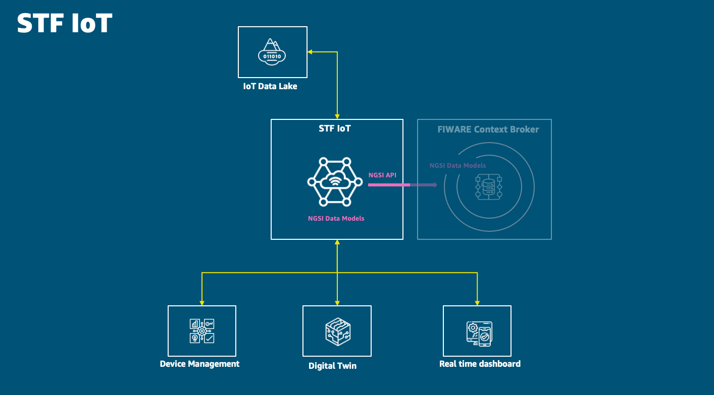
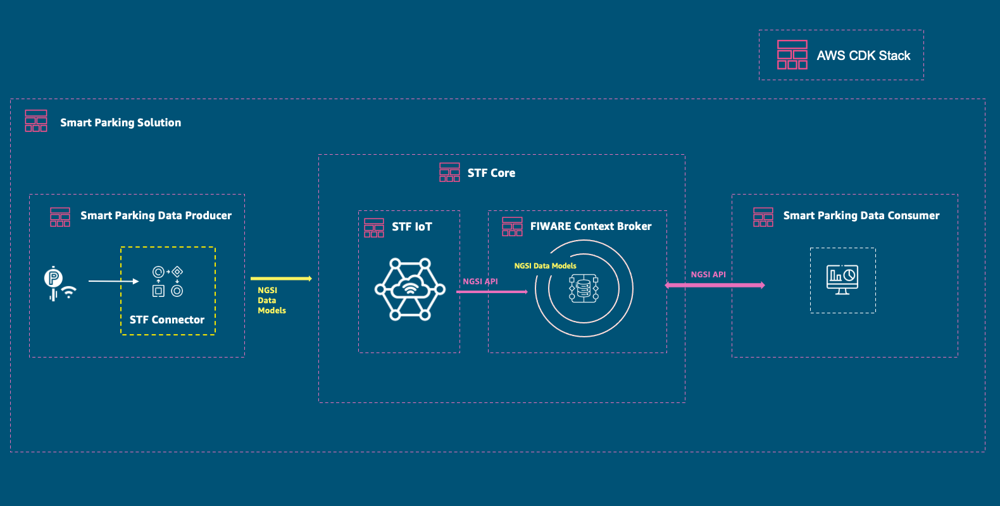
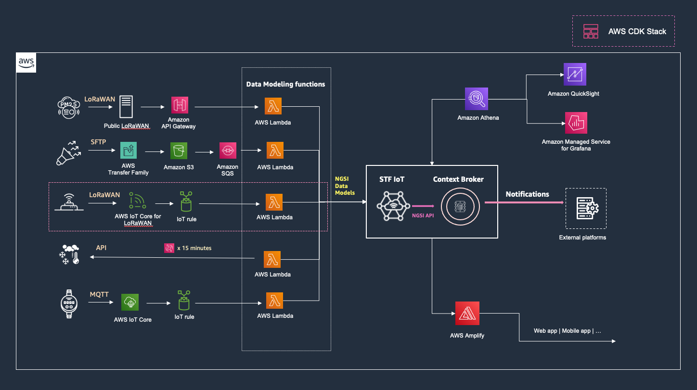

# Smart Territory Framework

Territories have the mission to deliver a good quality of life for their residents while facing growing and complex environmental, economic, and social challenges. Data is critical to gain insights that help optimize hard and soft infrastructure and build and operate efficient and sustainable services. 

The Smart Territory Framework - STF - is a set of tools and standardized modules that our partners and customers can assemble together to build and operate sustainable and highly effective solutions, in line with global industry standards and based on the open-source offering of the [FIWARE](https://www.fiware.org/) ecosystem 

 

 

## Table of Contents

- [Overview](#overview)
    - [FIWARE Context Broker](#fiware-context-broker)
    - [STF IoT module](#stf-iot-module)
    - [Built on an open standard](#built-on-an-open-standard)
- [Smart Territory Framework Catalog](#smart-territory-framework-catalog)
    - [STF Core](#stf-core)
    - [Building Data Producers and Data Consumers](#building-data-producers-and-data-consumers)
    - [Data Producers](#data-producers)
    - [Data Consumers](#data-consumers)
- [Additional Resources](#additional-resources)

 

## Overview

Modular and built on open source and standards, the STF makes it easy to integrate existing solutions and add new capabilities and modules over time to its core. The core of the STF - STF Core - consists of two modules: the STF IoT module and the open-source FIWARE Context Broker.

 

 

### FIWARE Context Broker

The FIWARE Context Broker is an open source component that enables the connection and integration of different systems, applications, and services within an organization.
Using the FIWARE Context Broker territories can assemble and store information from different systems, eventually belonging to different organisations, instead of having them perform in separate silos. 

 

 

It provides geo-located queries capabilities as well as a subscription mechanism. This allows an independent module like a mobile application to query data filtered by geographical location but also to be notified when changes on data take place (e.g., an air quality measurement is above a specified threshold value) or with a given frequency.   

### STF IoT module

Built around the FIWARE Context Broker, the STF IoT module expands its capabilities enabling territories to ingest IoT data at scale from multiple and heterogeneous sources with advanced device management capabilities. For example, it includes a registry of all the devices and sensors deployed in the territory, regardless the operating model, the technology and the connectivity used.

 

 

The STF IoT module offers digital twin capabilities, enabling territories to store and retrieve the current state of every registered device in real-time. It also consists of an IoT data lake built on [Amazon S3](https://aws.amazon.com/products/storage/data-lake-storage/) that territories can use to query and generate insights about their IoT data but also to easily visualise them.

### Built on an open standard

Built on an open standard, the Smart Territory Framework enables decoupling data producers from data consumers, to build scalable and interoperable solutions. 
The FIWARE Context Broker satisfies the [NGSI](https://www.etsi.org/technologies/internet-of-things) specification (specified by the ETSI Industry Specification Group on Context Information Management – [ETSI ISG CIM](https://www.etsi.org/technologies/internet-of-things)). 

This specification provides an open API for managing and requesting information and an underlying information model based on Entities that are digital representations of real-world object having `properties` and `relationships` with other entities. 

The STF leverages the [Smart Data Models](https://smartdatamodels.org/) initiative that provides NGSI compliant open-licensed data models (more than 700 as of March 2022) for different industry domains such as Smart Cities, Smart Agrifood, Smart Environment and Smart Manufacturing 

Using standardized and open API and data models help expand the capabilities of a platform based on the STF. Add new modules and capabilities, new data producers and consumers over time. Access a global market of standardized solutions facilitating the integration with your ecosystem of partners and solution providers. 

 

 

Build shareable, replicable and reusable end-to-end solutions based on standardized module that you or your customers can easily deploy and update using the [AWS Cloud Development Kit](https://aws.amazon.com/cdk/) (AWS CDK), our open-source software development framework. 

 

## Smart Territory Framework Catalog

Start building your smart solutions leveraging the no-cost open-source catalog of modules and samples of solutions we offer below.

You can use this catalog to implement a platform based on the STF with the flexibility to deploy the complete solution or any of its independent module including the STF IoT module and the Context Broker. 

The list below will be updated over time. 

### STF Core 

The core of the STF - STF Core - consists of two modules: the STF IoT module and the open-source FIWARE Context Broker. 
We provide below a list of the different flavors of the STF Core integrating the [multiple implementations](https://www.fiware.org/developers/catalogue/) of the FIWARE Context Broker available. 

- [**STF Core using NEC Scorpio Broker**](https://github.com/aws-samples/aws-stf-core-scorpio). NEC Laboratories Europe and AWS have worked together to provide a scalable and available implementation of the NEC Scorpio Broker 2.0 on AWS using [Serverless services](https://aws.amazon.com/serverless/?nc1=h_ls). 

- STF Core using Orion-LD (work in progress)

### Building Data Producers and Data Consumers 

When using the STF, Data Producers are decoupled from Data Consumers. You can build each of both independently as the information model is standardized and known in advance. 

You can for example build a [Grafana dashboard](https://docs.aws.amazon.com/grafana/latest/userguide/what-is-Amazon-Managed-Service-Grafana.html) to visualise your data [using Amazon Athena](https://aws.amazon.com/athena/) to query your IoT Data Lake. 

You can build your Data Producers within hours as the only process needed to integrate a new source of data, is to transform the source data format into the data model relevant to the use case before sending the data to the STF IoT module. 

Below a reference architecture with examples of Data Producers and Data Consumers. 

 

 

For each Data Producer, it is about using the right tool to ingest the data and route it to a [Lambda function](https://docs.aws.amazon.com/lambda/latest/dg/welcome.html) that will transform the source data format into an NGSI-LD entity and then publish it into the STF IoT Queue. 

### Data Producers 

- [**Smart Parking - Bosch PLS**](https://github.com/aws-samples/aws-stf-dp-boschpls). A CDK application to deploy a Data Producer that ingests data from the Bosch PLS, LoRaWAN Parking Lot sensors, using AWS IoT Core for LoRaWAN

### Data Consumers 

- Coming soon...

## Additional Resources

This section provides links to additional resources that may help implement solutions based on the Smart Territory Framework: 

- [FIWARE NGSI-LD Tutorial](https://ngsi-ld-tutorials.readthedocs.io/en/latest/)
- [JSON-LD, NGSI-LD, Digital Twins and Smart Data Models](https://www.youtube.com/watch?v=dfigPKx99Bs)
- [Smart Data Models](https://smartdatamodels.org/)
- [AWS CDK Workshop](https://cdkworkshop.com/)

## Security

See [CONTRIBUTING](CONTRIBUTING.md#security-issue-notifications) for more information.

## License

This library is licensed under the MIT-0 License. See the LICENSE file.

